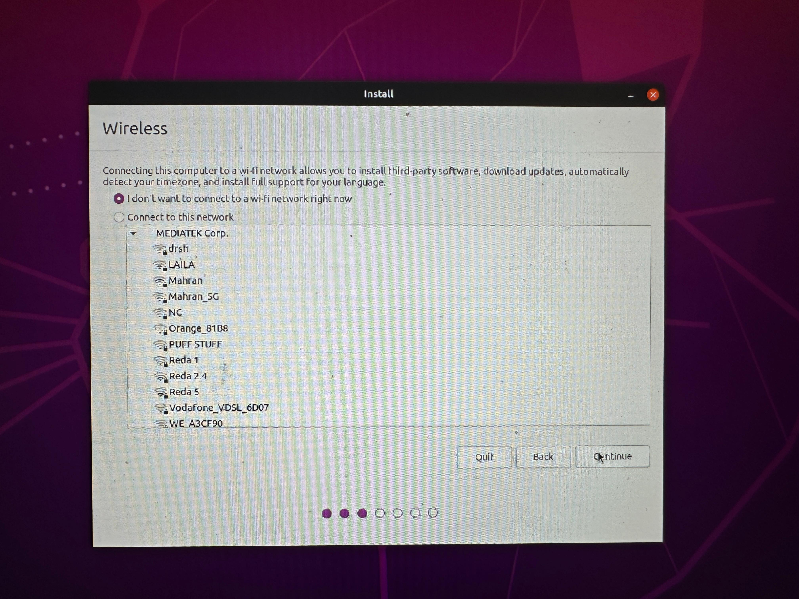
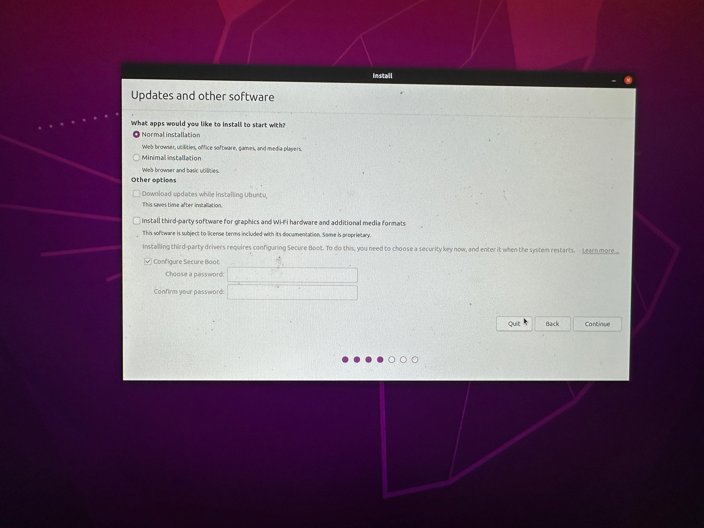
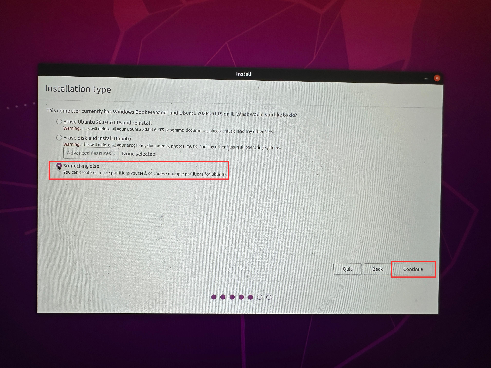
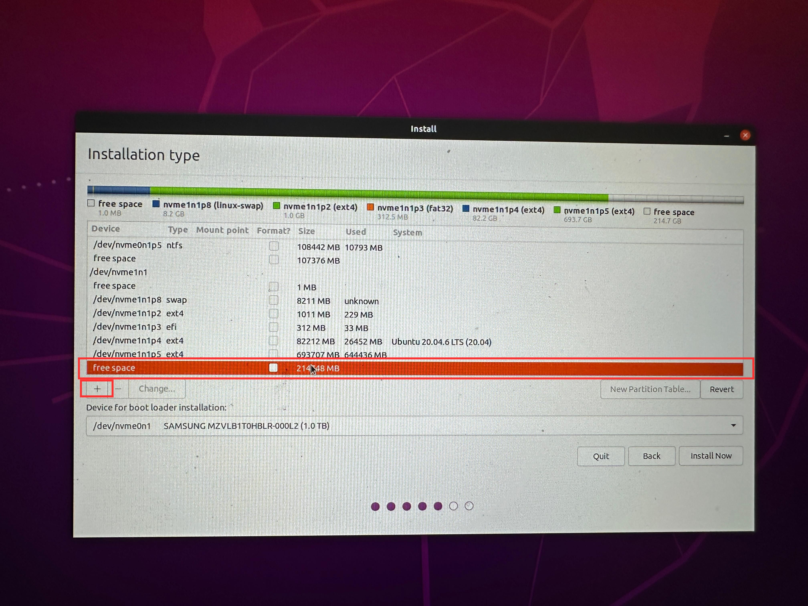
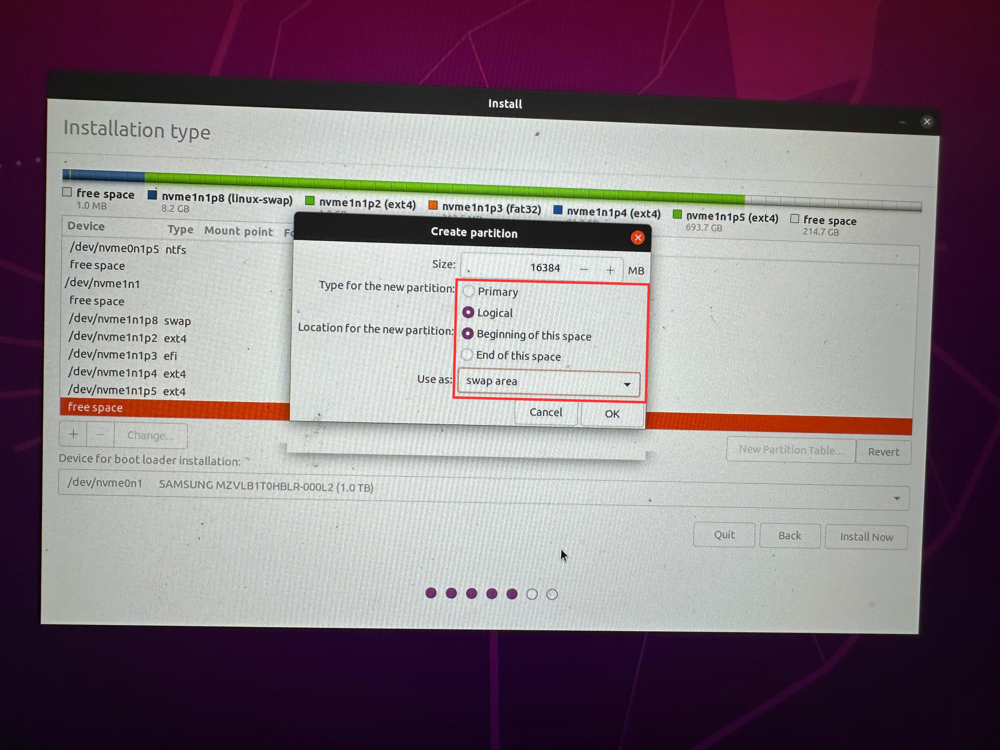

# Installing Ubuntu 20.04 as Dual Boot
## 1. Create a Bootable USB
- Download [RUFUS](https://rufus.ie/en/) to flash the USB

- Download [Ubuntu 20.04](https://releases.ubuntu.com/focal/) iso image

- Open RUFUS and select your USB as well as the iso image and press start

- Choose the following options in the pop up menu and press ok

- Wait for the operation to end then close RUFUS

## 2. Creating an Empty Partition
- Open Disk Management in Windows and locate the partition you want to shrink

- Write click on the partition and select Shrink Volume

- Choose the amount of free space you want and press shrink (Recommended at least 100GB which is 102400MB)

- You can see the unallocated space for Ubuntu

## 2. Installing Ubuntu
- Restart the computer and enter the boot menu by repeatedly pressing `F12` on Lenovo and DELL Laptops and `F9` on HP Laptops

- Select your USB device as a boot device

- When Ubunutu loads choose `Ubuntu` Option

- Wait for Ubuntu to open then press Install Ubuntu

- Choose English in both options and press continue

- Connect to a WiFi network and press continue

- Choose Normal Installation and uncheck any other option and press continue

- Choose Something else and press continue

- Locate the free space we created in Windows (Look for the size) and press the `+` button

- Create a swap area as a logical partition at the beginning of this space as shown. The swap size is at least half the RAM size and at most double the RAM size. So for an 8GB RAM the minimum is 4GB and maximum is 16GB 

