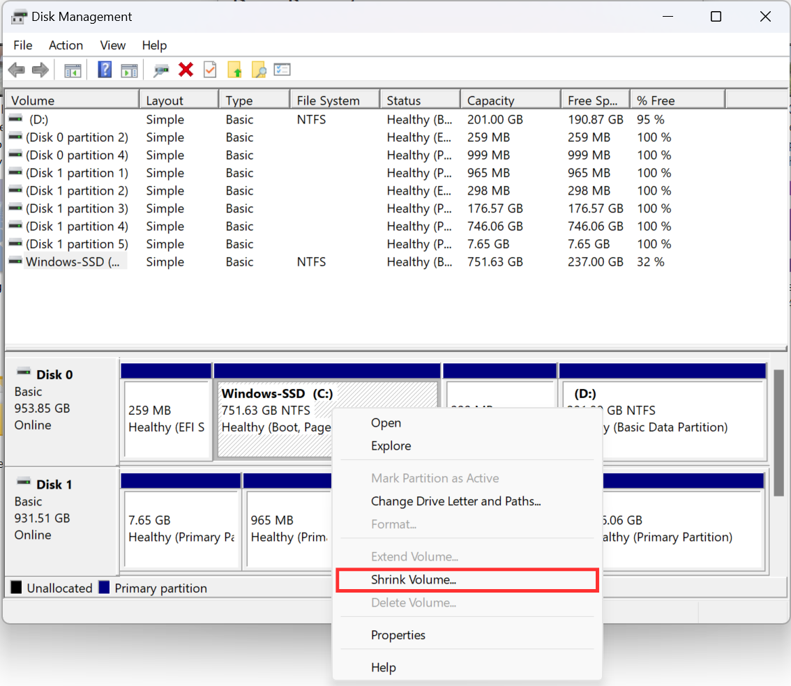
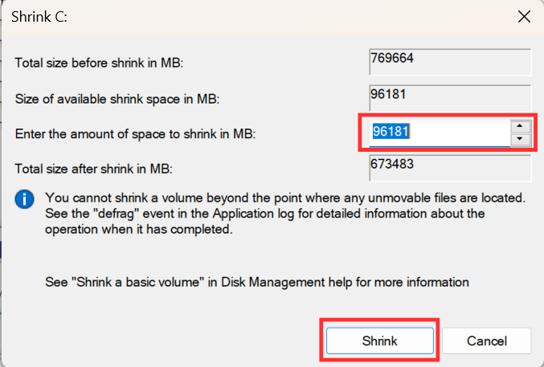
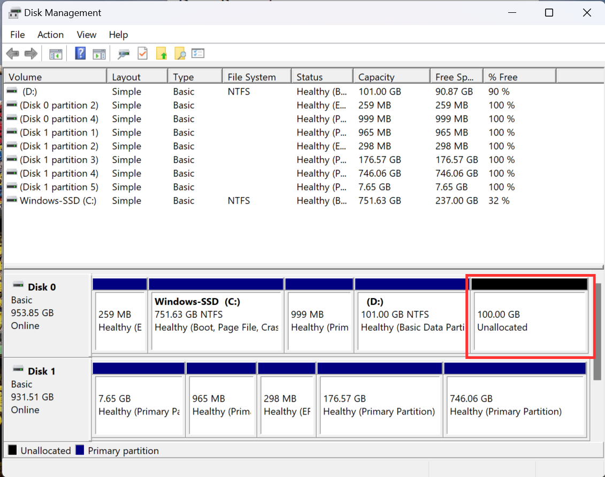

# Installing Ubuntu 20.04 as Dual Boot
## 1. Create a Bootable USB
- Download [RUFUS](https://rufus.ie/en/) to flash the USB

- Download [Ubuntu 20.04](https://releases.ubuntu.com/focal/) iso image

- Open RUFUS and select your USB as well as the iso image and press start

- Choose the following options in the pop up menu and press ok

- Wait for the operation to end then close RUFUS

## 2. Creating an Empty Partition
- Open Disk Management in Windows and locate the partition you want to shrink

- Write click on the partition and select Shrink Volume

- Choose the amount of free space you want and press shrink (Recommended at least 100GB which is 102400MB)

- You can see the unallocated space for Ubuntu

## 2. Installing Ubuntu
- Restart the computer and enter the boot menu by repeatedly pressing `F12` on Lenovo and DELL Laptops and `F9` on HP Laptops

- Select your USB device as a boot device

- When Ubunutu loads the 

- Write click on the partition and select Shrink Volume

- Choose the amount of free space you want and press shrink (Recommended at least 100GB which is 102400MB)

- You can see the unallocated space for Ubuntu

