# Installing Ubuntu 22.04 as Dual Boot
## 1. Create a Bootable USB
- Download [RUFUS](https://rufus.ie/en/) to flash the USB

- Download [Ubuntu 22.04](https://releases.ubuntu.com/jammy/) iso image

- Open RUFUS and select your USB as well as the iso image and press start

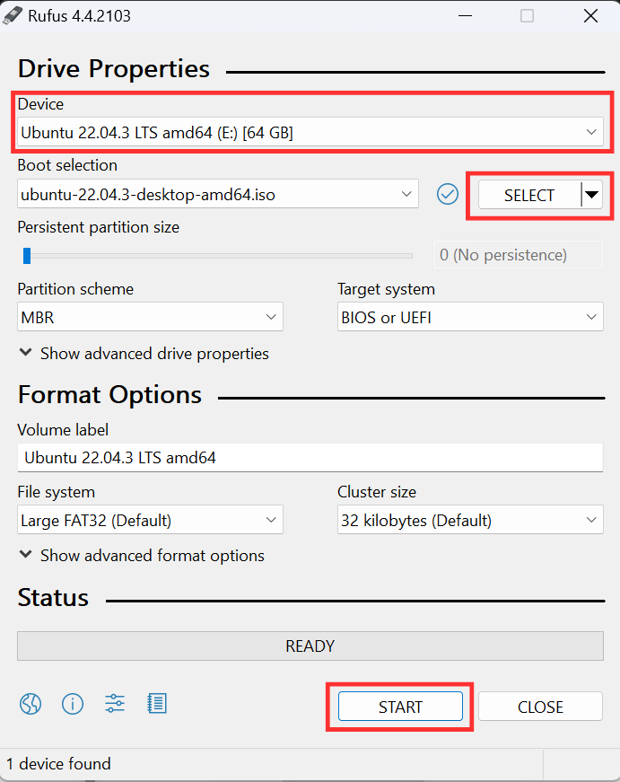

- Choose the following options in the pop up menu and press ok


- Wait for the operation to end then close RUFUS

## 2. Creating an Empty Partition
- Open Disk Management in Windows and locate the partition you want to shrink


- Write click on the partition and select Shrink Volume


- Choose the amount of free space you want and press shrink (Recommended at least 100GB which is 102400MB)


- You can see the unallocated space for Ubuntu


## 2. Installing Ubuntu
- Restart the computer and enter the boot menu by repeatedly pressing `F12` on Lenovo and DELL Laptops and `F9` on HP Laptops

- Select your USB device as a boot device

- When Ubunutu loads choose `Ubuntu` Option

- Wait for Ubuntu to open then press Install Ubuntu


- Choose English in both options and press continue

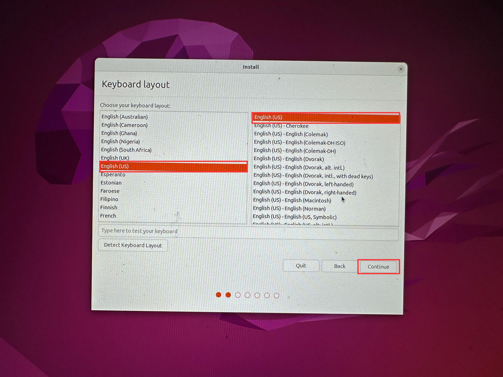

- Connect to a WiFi network and press continue

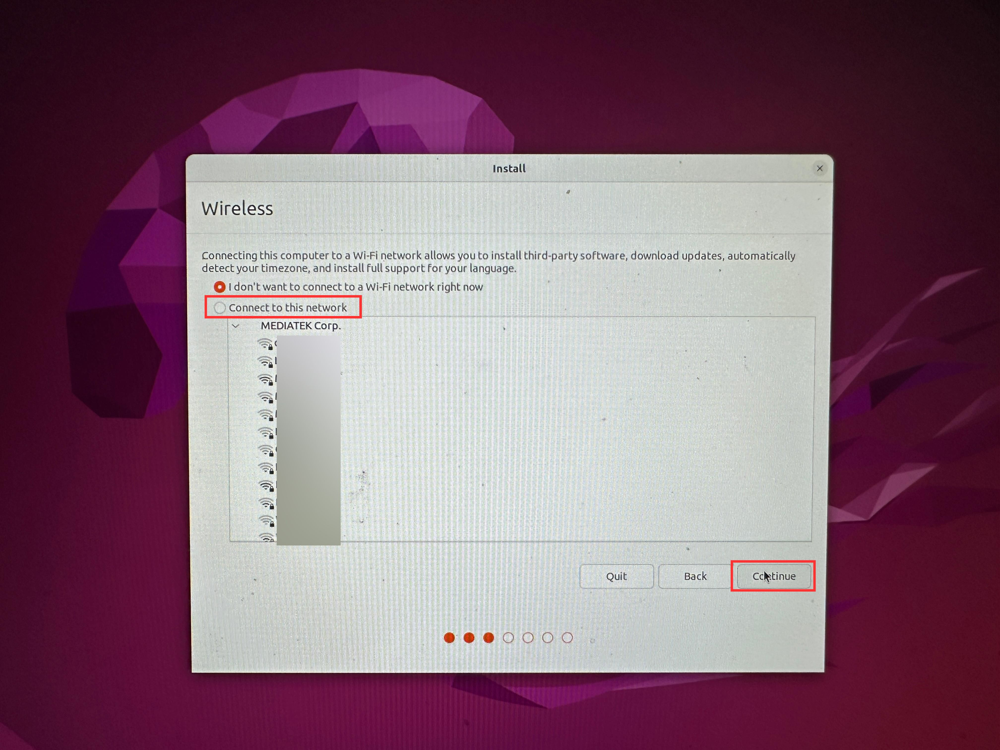

- Choose Normal Installation and uncheck any other option and press continue

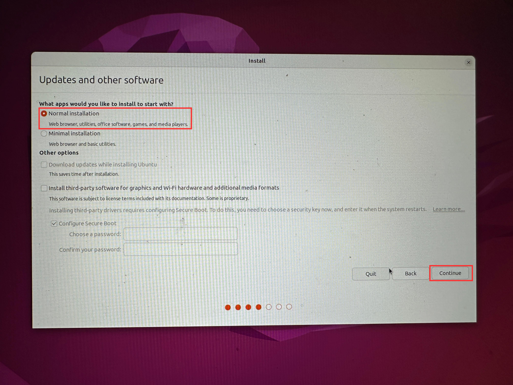

- Choose Something else and press continue

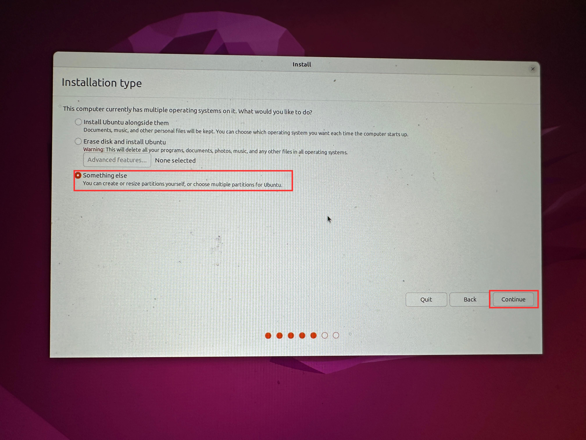

- Locate the free space we created in Windows (Look for the size) and press the `+` button to create different partitions


- Create a swap area as a logical partition at the beginning of this space as shown. The swap size is at least half the RAM size and at most double the RAM size. So for an 8GB RAM the minimum is 4GB and maximum is 16GB 

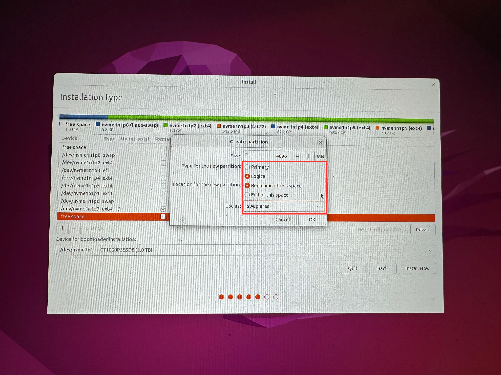

- Create a root folder as a logical partition at the beginning of this space and mount point `/` as shown. The recommended root folder size is 30GB (30720MB)

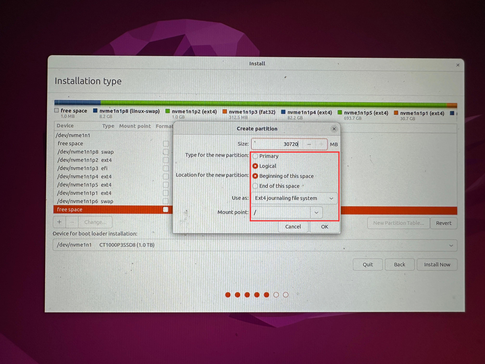

- Allocate the remaining space for the home folder as a logical partition at the beginning of this space and mount point `/home` as shown.

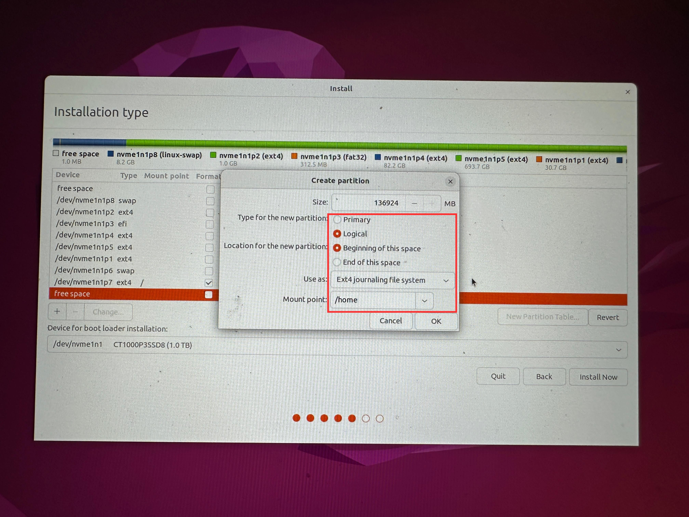

- You should have the partitions as shown. Choose your hard drive as the boot loader installation device and press install now

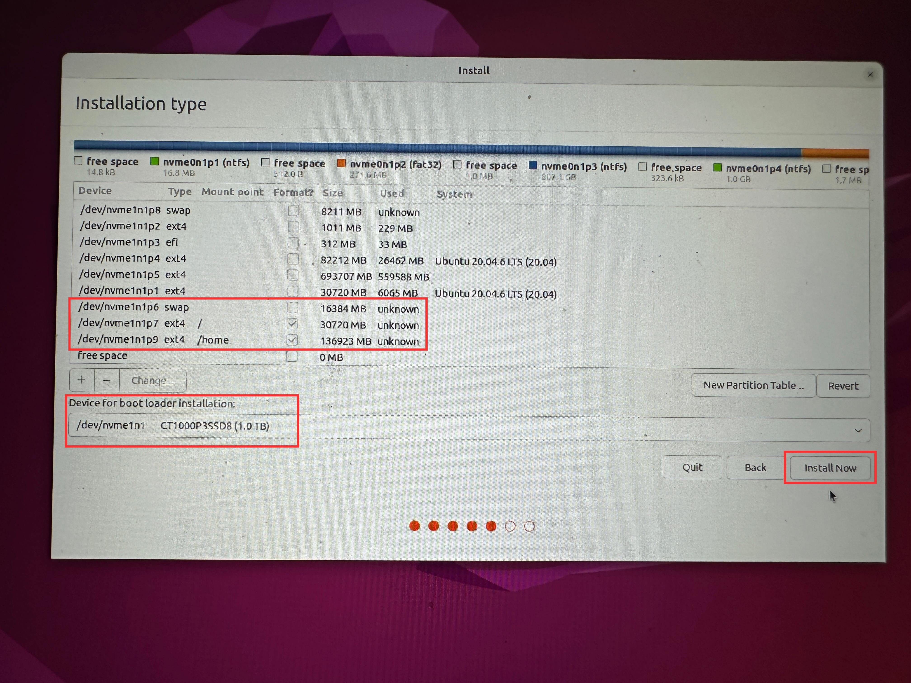

- Choose your country and press continue

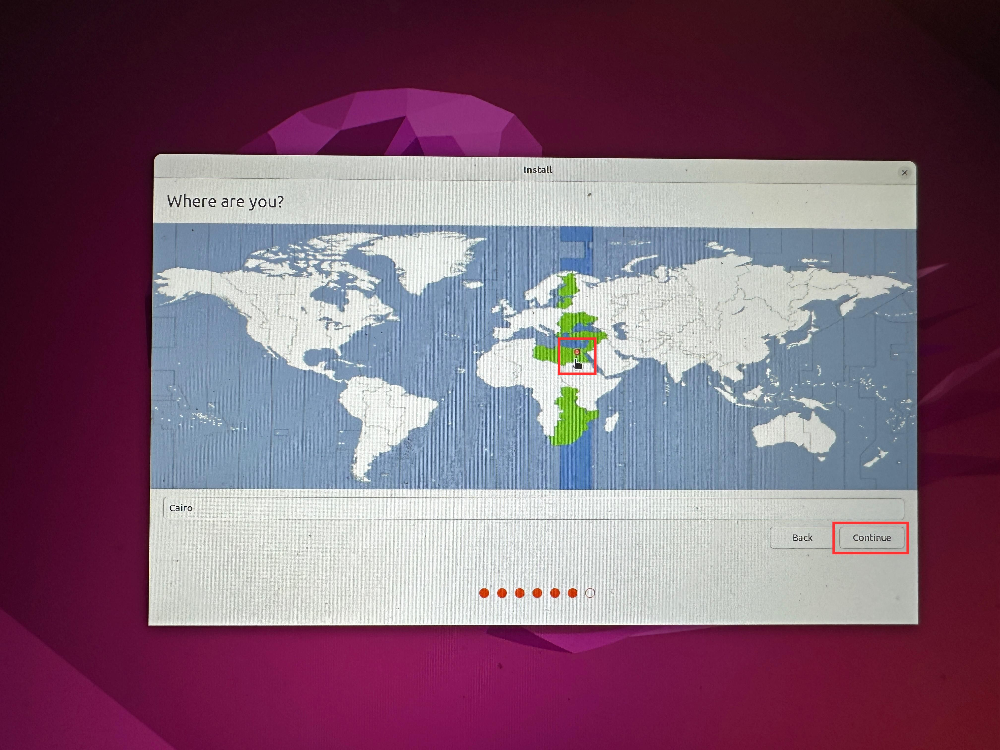

- Finally fill out your info and press continue

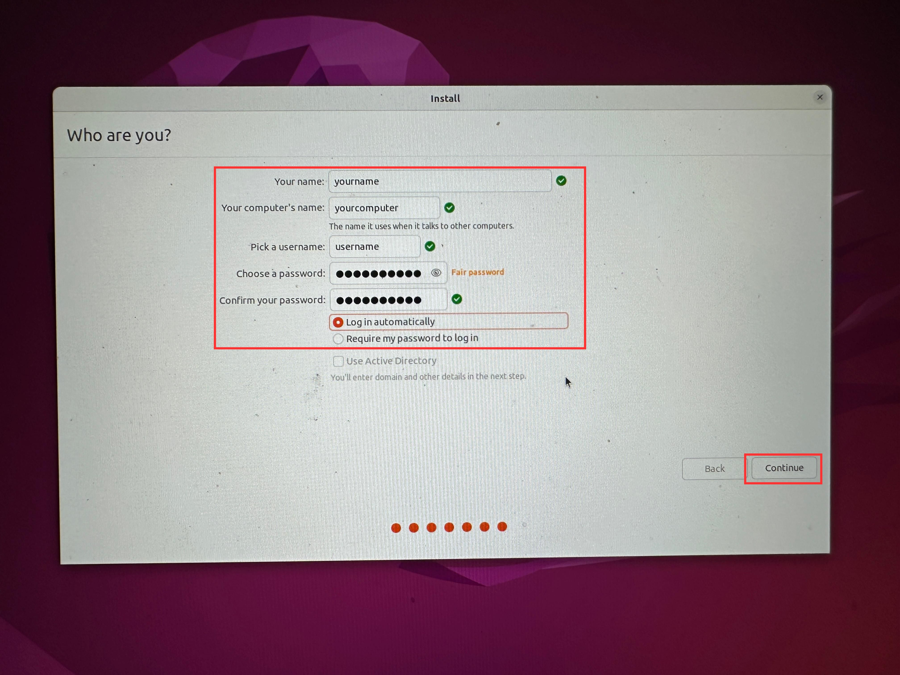

- When the installation finishes press restart

## 3. After Installation
Boot into Ubuntu and open a new terminal using `CTRL` + `ALT` + `T` or from the applications pane and execute the following commands. You will be asked to enter your password
```bash
sudo apt update && sudo apt upgrade -y
```

In order to play media files like MP#, MPEG4, AVI etc, you’ll need to install media codecs. Ubuntu has them in their repository but doesn’t install it by default because of copyright issues in various countries
```bash
sudo apt install ubuntu-restricted-extras
```